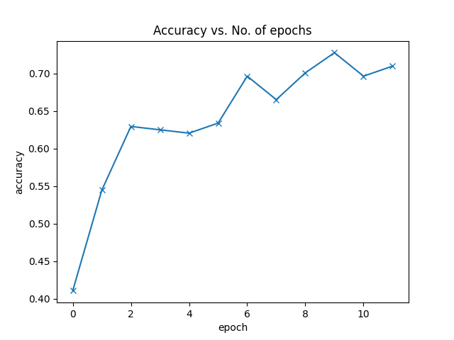

<h1 align="center">FlowerPower</h1>

<div align="center">
  <strong>Classifying flowers using the Flower Dataset</strong>
</div>
<div align="center">
  <code>A tiny project for Complori</code> 
</div>

## Install
* Clone repository
  ```
  git clone https://github.com/sycz00/FlowerPower.git
  ```
* Create Docker image
  ```
  docker build -t flower .
  ```
## Docker Networking and Running
* Assign a static IP to container by defining subnetmasking
```
docker network create --subnet 192.0.2.0/24 flower_power_net
```
* Run Docker image with static ip (remove -d flag if you don't want to run the container in the background)
```
docker run -p 5000:80 -itd --network=flower_power_net --ip=192.0.2.69 flower
```
* Find and Stop Docker service when using -d flag
```
docker ps
```
```
docker stop <CONTAINER ID>
```
Following the instructions until this point, the Docker container should be running

## Using the API
* Inference of example image <code>daisy.png</code> by sending it to static ip assigned in previous step
```
curl -X POST -F "file=@inference_test/daisy.jpg" http://192.0.2.69:5000/predict
```
* Request a new training process, includes overwriting the existing checkpoint with new one. Custom number of epochs and learning-rate can be used here
```
curl -X POST -H "Content-Type: application/json" -d '{"epochs": 10,"lr":0.001}' http://192.0.2.69:5000/train
```


## Process
* The following image shows the training progress on the validation dataset. it can be seen that the shallow CNN makes reasonable progress.



### Dataset
- [x] [Flower Dataset](https://www.kaggle.com/alxmamaev/flowers-recognition/flowers](https://www.kaggle.com/code/rayankazi/flowers-classification-pytorch)https://www.kaggle.com/code/rayankazi/flowers-classification-pytorch)
